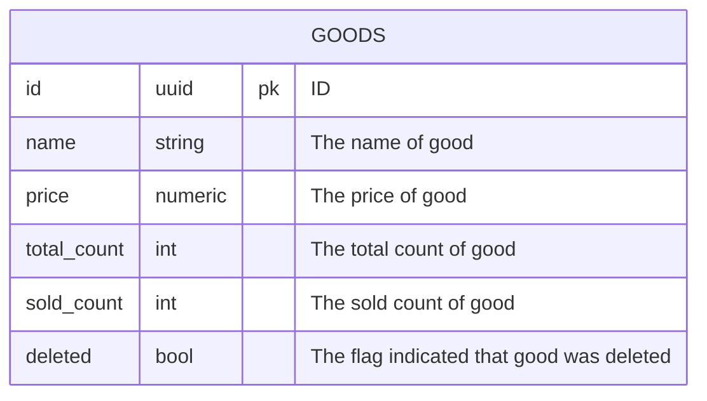

This article will show how to use jOOQ in your spring boot projects.

Why do we need jOOQ?
There is a lot of pain using JPA and Hibernate. That is why we have something jOOQ.

First, we need to create a database schema. In this article, we will develop 
a simple CRUD (create, read, update, and delete) application to manage goods.

The first step is to design our database. The application will contain only one table — goods. The table looks like below.

### Access full article



