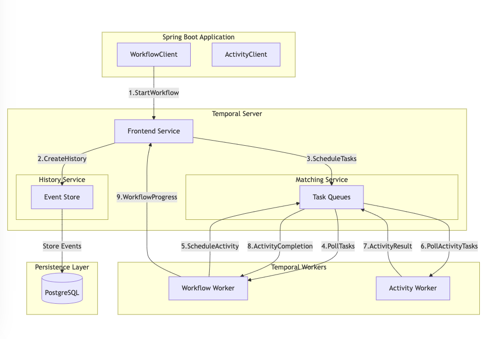

A guide to building resilient, distributed apps with Spring Boot and Temporal's orchestration.

### Introduction
Building reliable distributed applications can be challenging. System crash, network fail, and processes 
can get stuck halfway through execution. This is where Temporal comes in. It is an open-source workflow orchestration platform.
When combined with Spring Boot, it helps you build robust apps. These apps can handle real-world challenges.

### Why should you care about Temporal?
If you've worked with distributed systems, you've likely faced process failures. They can leave your system inconsistent. 
They processed a payment but didn't update the order. Or, they sent an email but didn't update the database. 
Temporal solve these problems. It provides durable execution, automatic retries, and state management.
With Spring Boot, Temporal gives you tools for complex processes. It also keeps familiar Spring ecosystem you know.
You get the best of both worlds. You get Spring's dependency injection and configuration. You also get Temporal's workflow management features.

### Setting up your environment
Before we dive into the code, let set up our development environment. We'll need two things: a Spring Boot application with Temporal dependencies and running Temporal server.
First, let's create our project with the necessary dependencies:

```xml {filename="pom.xml"}
<?xml version="1.0" encoding="UTF-8"?>
<project xmlns="http://maven.apache.org/POM/4.0.0" xmlns:xsi="http://www.w3.org/2001/XMLSchema-instance"
         xsi:schemaLocation="http://maven.apache.org/POM/4.0.0 https://maven.apache.org/xsd/maven-4.0.0.xsd">
    <modelVersion>4.0.0</modelVersion>
    <parent>
        <groupId>org.springframework.boot</groupId>
        <artifactId>spring-boot-starter-parent</artifactId>
        <version>3.4.0</version>
        <relativePath/> <!-- lookup parent from repository -->
    </parent>
    <groupId>me.vrnsky</groupId>
    <artifactId>temporal-spring-boot</artifactId>
    <version>0.0.1-SNAPSHOT</version>
    <name>temporal-spring-boot</name>
    <description>temporal-spring-boot</description>
    <properties>
        <java.version>17</java.version>
        <temporal.version>1.17.0</temporal.version>
    </properties>
    <dependencies>
        <dependency>
            <groupId>org.springframework.boot</groupId>
            <artifactId>spring-boot-starter-actuator</artifactId>
        </dependency>
        <dependency>
            <groupId>org.springframework.boot</groupId>
            <artifactId>spring-boot-starter-web</artifactId>
        </dependency>
        <dependency>
            <groupId>io.temporal</groupId>
            <artifactId>temporal-sdk</artifactId>
            <version>${temporal.version}</version>
        </dependency>
        <dependency>
            <groupId>io.micrometer</groupId>
            <artifactId>micrometer-registry-prometheus</artifactId>
            <scope>runtime</scope>
        </dependency>
        <dependency>
            <groupId>org.projectlombok</groupId>
            <artifactId>lombok</artifactId>
            <optional>true</optional>
        </dependency>
        <dependency>
            <groupId>org.springframework.boot</groupId>
            <artifactId>spring-boot-starter-test</artifactId>
            <scope>test</scope>
        </dependency>
    </dependencies>

    <build>
        <plugins>
            <plugin>
                <groupId>org.apache.maven.plugins</groupId>
                <artifactId>maven-compiler-plugin</artifactId>
                <configuration>
                    <annotationProcessorPaths>
                        <path>
                            <groupId>org.projectlombok</groupId>
                            <artifactId>lombok</artifactId>
                            <version>1.18.32</version>
                        </path>
                    </annotationProcessorPaths>
                </configuration>
            </plugin>
            <plugin>
                <groupId>org.springframework.boot</groupId>
                <artifactId>spring-boot-maven-plugin</artifactId>
                <configuration>
                    <excludes>
                        <exclude>
                            <groupId>org.projectlombok</groupId>
                            <artifactId>lombok</artifactId>
                        </exclude>
                    </excludes>
                </configuration>
            </plugin>
        </plugins>
    </build>

</project>
```

Next, we'll need a running Temporal server. The easiest way to get started by using Docker:
```yaml {filenam="docker-compose.yml"}
version: '3.5'
services:
  postgresql:
    image: postgres:13
    environment:
      POSTGRES_USER: temporal
      POSTGRES_PASSWORD: temporal
    ports:
      - "5432:5432"
    networks:
      - temporal-network

  temporal:
    image: temporalio/auto-setup:1.20.0
    depends_on:
      - postgresql
    environment:
      - DB=postgresql
      - DB_PORT=5432
      - POSTGRES_USER=temporal
      - POSTGRES_PWD=temporal
      - POSTGRES_SEEDS=postgresql
    ports:
      - "7233:7233"
    networks:
      - temporal-network

  temporal-web:
    image: temporalio/web:1.15.0
    environment:
      - TEMPORAL_GRPC_ENDPOINT=temporal:7233
      - TEMPORAL_PERMIT_WRITE_API=true
    ports:
      - "8088:8088"
    depends_on:
      - temporal
    networks:
      - temporal-network

networks:
  temporal-network:
    driver: bridge
```

### Understanding how Temporal works

Think of Temporal as a sophisticated task manager for your distributed processes. 
When your Spring Boot app want to start a workflow, it talks to Temporal via the WorkflowClient.
Temporal then manages the entire process. It ensures each step achieves success.
It maintains your workflow's state, even if systems crash or network fail.

### Access full article




