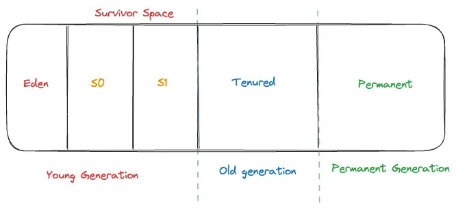

Hello everyone! In this article, we discuss advanced Java Garbage Collection: G1 and ZGC.

Introduction
Both garbage collectors are designed to optimize memory management in large-scale applications by improving the efficiency of memory allocation, deallocation, and garbage collection. Both G1 and ZGC are designed to reduce pauses while performing the garbage collection cycle and improve overall system performance.

G1 or Garbage First
G1 is a fully incremental garbage collector that divides memory into multiple regions. The G1 garbage collector is concurrent. The division approach brings more efficient usage of memory by dynamically allocating objects in different regions based on their usage patterns.

The key features:
1. Region-based Heap
- The heap is divided into several large regions
- Each region can be managed independently
2. Concurrent collection
- Garbage collection occurs concurrently with application execution, minimizing pauses.
- The G1 utilizes a parallel collector to perform the actual work of collecting garbage
3. Incremental collection
- By using incremental collection techniques that allow parts of the heap to be collected without stopping the entire application
4. Live Data Set Tracking
- “Young set” and “old set” are used to track live objects
- The old set handles major collections, while the young set is used for minor collections
5. Scavenger Mechanism
- In a situation when the young set becomes full, G1 uses the scavenger to reclaim memory by moving live objects from young to an old set
- This process helps in reducing fragmentation and improving memory utilization.

### Access full article



