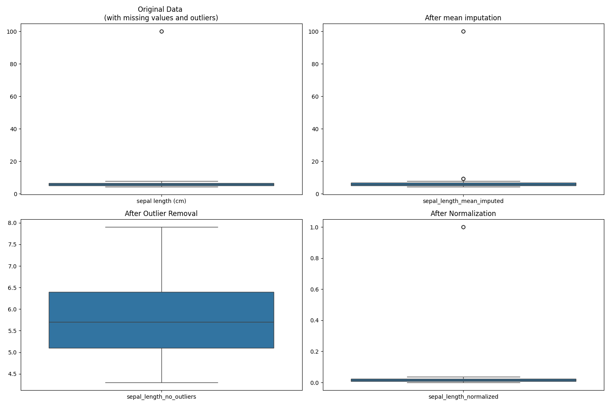
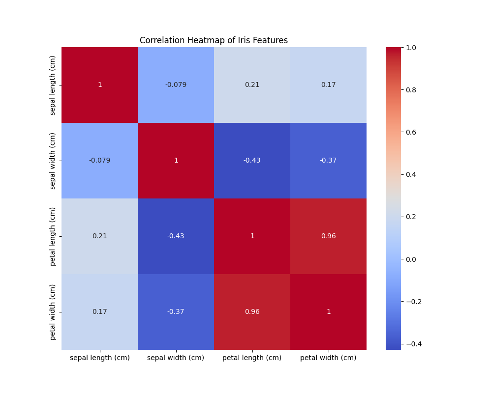

```python {filename="data-preparation.py"}
import pandas as pd
import numpy as np
import matplotlib.pyplot as plt
import seaborn as sns
from sklearn.datasets import load_iris

iris = load_iris()
df = pd.DataFrame(data = np.c_[iris['data'], iris['target']], columns = iris['feature_names'] + ['target'])

print("Dataset overview:")
print("\nShape:", df.shape)
print("\nFirst few ros:")
print(df.head())
print("\nBasic statics")
print(df.describe())
print("\nMissing value")
print(df.isnull().sum())


np.random.seed(42)
df.loc[np.random.choice(df.index, 10), 'sepal length (cm)'] = np.nan
df.loc[np.random.choice(df.index, 5), 'sepal length (cm)'] = 100

### Handle missing values in dataset
df['sepal_length_mean_imputed'] = df['sepal length (cm)'].fillna(df['sepal length (cm)'].mean())

### Handle outliers using z - score method
def remove_outliers(data, threshold = 3):
    z_scores = np.abs((data - data.mean())/data.std())
    return data[z_scores < threshold]

df['sepal_length_no_outliers'] = df['sepal length (cm)']
df.loc[df['sepal_length_no_outliers'] > 10, 'sepal_length_no_outliers'] = np.nan
df['sepal_length_no_outliers'] = remove_outliers(df['sepal_length_no_outliers'])

### Data normalization
df['sepal_length_normalized'] = (df['sepal length (cm)'] - df['sepal length (cm)'].min()) / \
                               (df['sepal length (cm)'].max() - df['sepal length (cm)'].min())

plt.figure(figsize=(15, 10))

### Show original data with missing values and outliers
plt.subplot(2, 2, 1)
sns.boxplot(data=df[['sepal length (cm)']])
plt.title("Original Data \n(with missing values and outliers)")

### Data after mean imputation
plt.subplot(2, 2, 2)
sns.boxplot(data=df[['sepal_length_mean_imputed']])
plt.title("After mean imputation")

# 3. Data after outlier removal
plt.subplot(2, 2, 3)
sns.boxplot(data=df[['sepal_length_no_outliers']])
plt.title('After Outlier Removal')

# 4. Data after normalization
plt.subplot(2, 2, 4)
sns.boxplot(data=df[['sepal_length_normalized']])
plt.title('After Normalization')

plt.tight_layout()
plt.show()

# Create a correlation heatmap
plt.figure(figsize=(10, 8))
correlation_matrix = df.iloc[:, :4].corr()
sns.heatmap(correlation_matrix, annot=True, cmap='coolwarm')
plt.title('Correlation Heatmap of Iris Features')
plt.show()
```


