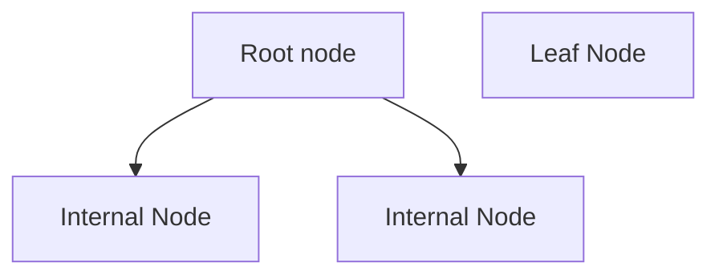

### Properties of decision tree
- Root node (parent node)
- Internal node (child node)
- Leaf node (terminal node)
- Test condition

### Example

### Tree induction
#### Greedy strategy
Split the records based on an attribute test that optimizes certain criterion.
Nodes with **homogeneous** class distribution (low degree of impurity) are preferred.
Need a measure of node impurity.

Entropy:
- Measure homogeneity of a node
- **Maximum** when records are equally distributed among all classes implying the least information.
- **Minimum** when all records belong to one class (of target attribute), implying most information. 

### Notes
Do not use ids for data modeling and prediction.
The higher the entropy/gini/misclassification the lower the purity of a node.
Error value should be less.

### Detailed explanation
Think of a decision tree like a flowchart that helps make decisions through a series of questions.
It's similar to how a doctor diagnoses a patient - starting with general questions and
getting more specific until reaching a conclusion.

As its heart, a decision tree start with a single point (called the `root node`) that represents
your entire dataset. From there, it asks a series of yes/no questions about different features in 
your data. Each question splits the data into smaller groups based on the answers. For example,
if you are trying to predict whether someone will like a movie, the tree might first ask 

> Is the movie longer than 2 hours?

Then based on that answer, it might asks

> Is it an action movie

and so on.

What makes decision trees particularly useful is how they choose which questions to ask.
They use mathematical measures like entropy or gini index to determine which splits will be informative.
Think of it like playing 20 questions - you want each question to give you the most useful information possible.
The tree automatically finds the questions that best separate the data into distinct groups.

One of the most appealing aspects of decision trees is their transparency. Unlike many other machine learning
methods that work like a black box, decision trees shows you exactly how they reached their conclusion. You can follow
the path from top to bottom and understand how they reached their conclusion. You can follow the path from top
to bottom and understand each decision point along the way. This makes them especially valuable in fields
like medicine or finance where you need to explain why a particular decision was made.

However, decision trees do have their challenger. They can sometimes become too complex, like a person
who asks too many questions before making a decision. This is called **overfitting**, and it happens when
the tree starts paying attention to noise in the training data rather than finding genuine patterns.
To address this, we often need to _prune_ the tree - essentially simplifying it by removing some of the less 
important decision points.

Another interesting aspects is how decision trees handle different types of data. They work 
equally well with numerical data (like age or income) and categorical data (like color or type). They can
even handle missing data reasonably well, which is quite valuable in real - world applications
where data if often incomplete.

The process of building a tree naturally reveals which feature are most important for making predictions.
The questions asked at the top of the tree usually the most crucial ones, while those near 
the bottom have less impact on the final decision. This insight into feature importance 
can be incredibly valuable for understanding.

